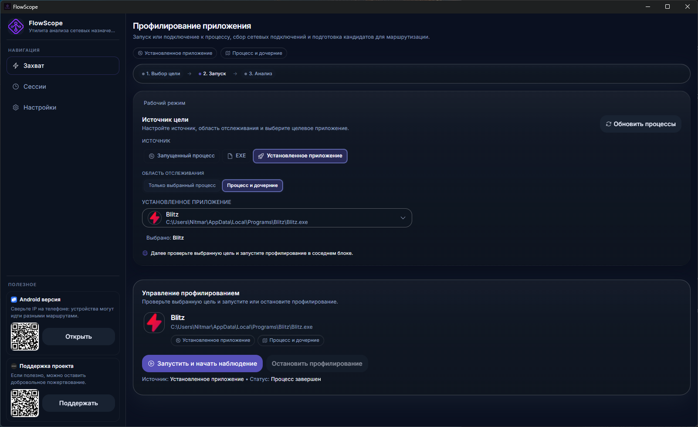
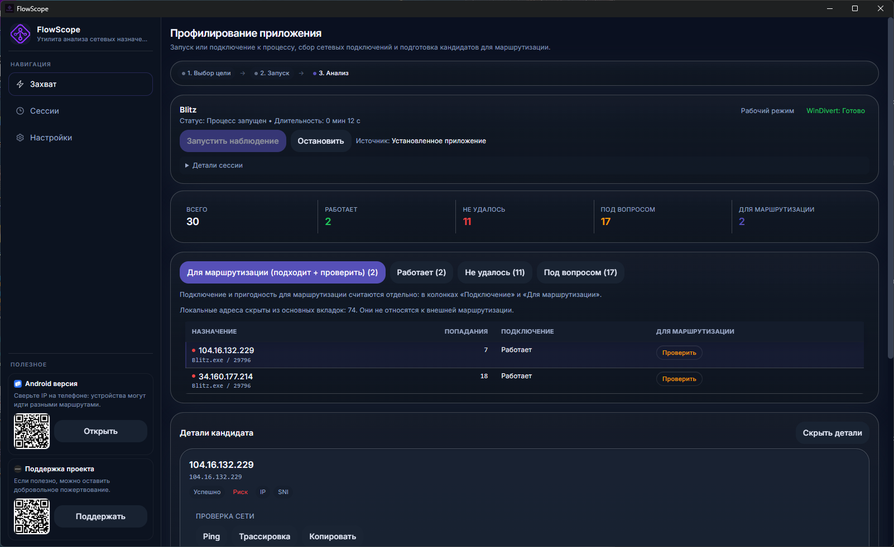

# FlowScope Download

Официальная публичная страница загрузки FlowScope для Windows.

## Скачать

- [Скачать установщик EXE](https://github.com/NitmarCG/FlowScope-download/releases/latest/download/FlowScope_0.1.0_x64-setup.exe)
- [Скачать установщик MSI](https://github.com/NitmarCG/FlowScope-download/releases/latest/download/FlowScope_0.1.0_x64_en-US.msi)
- [Открыть последний релиз](https://github.com/NitmarCG/FlowScope-download/releases/latest)

## Важно

Для рабочего режима (WinDivert) запускайте FlowScope **от имени администратора**.

## Скриншоты

## Полезные ссылки

- Android-версия в RuStore: [RuStore](https://rustore.ru/catalog/app/com.flowscope.app)
- Telegram-сообщество: [FlowScope Community](https://t.me/+hb-DRDCPfUNiZWQy)
- Поддержка проекта: [Netmonet](https://netmonet.co/tip/593087?o=6)
